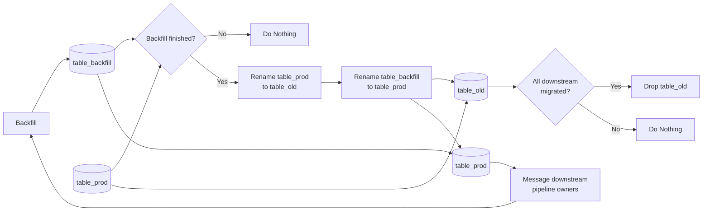

# Notes from Videos

## Managing ad-hoc requests

- Allocate 5-10% of capacity per quarter to ad-hoc requests.
- If the ad-hoc request is complex you shouldn't drop what you're doing.
- Low hanging fruit could be prioritized though.
- Get analytics stakeholders input for quarterly planning.

## Centralized vs Embedded Teams

### Centralized Teams

Many data engineers in one team.

- Pros:
  - On-call is easier.
  - Knowledge sharing is easier, data engineers supporting data engineers.

- Cons:
  - It's more expensive.
  - Prioritization can get complex.

### Embedded Teams

Data engineers spread across different engineering teams.

- Pros:
  - Dedicated data engineer support for each team.
  - Data engineers gain deep domain knowledge.

- Cons:
  - Islands of responsibility.
  - Data engineers can feel isolated.

## Common issues in data pipelines

- Skewed pipelines that go OOM.
  - In Spark 3 enable adaptive query execution.

> [!NOTE]
> AQE can be enabled by setting SQL configuration `spark.sql.adaptive.enabled` to `true` (default `false` in Spark 3.0), and applies if the query meets the following criteria:
>
> - It is not a streaming query.
> - It contains at least one exchange (usually when there's a join, aggregate or window operator) or one sub-query

- Missing data/ schema changes of upstream data sources.

- Backfills need to trigger downstream data models.

> [!NOTE]
> If people need more time to migrate:
>
> - Build a parallel pipeline that populates `table_v2` while people migrate.
> - After all references have been updated from `table_prod` to `table_v2`, drop `table_prod` and rename `table_v2` to `table_prod`, and update all its references again.

## Large cloud bills (FinOps)

- I/O operations are usually the number one cloud cost.
- Followed by compute.
- And then storage.

### Common causes of excessive I/O operations

- Duplicated data models.
- Inefficient data pipelines (use cumulative design when possible)
- Excessive backfills.
- Not leveraging sampling when possible.
- Not sub-partitioning data correctly (predicate push-down is your friend).
