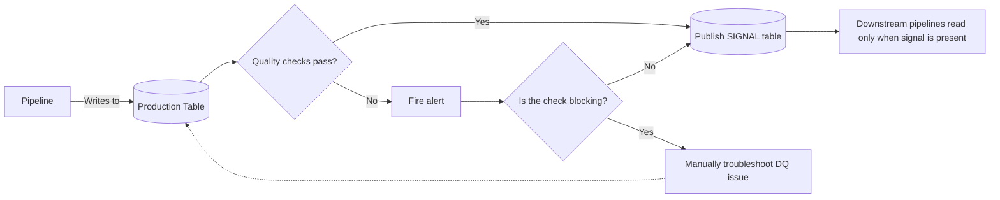
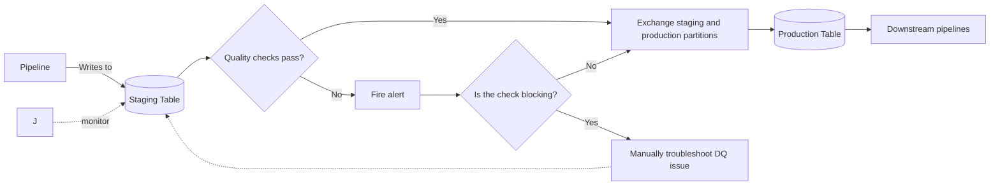

# Data Quality

## 1. Airbnb MIDAS Process

A structured review process to design a new data pipeline and take it into production safely.

It's a design + review + validation framework that ensures pipeline quality before production.

### Step 1: Design Spec

A good design spec should include:

* **Description** → Why are you building this? (motivation, business case)
* **Flow Diagrams** → Visual representation of data flow
* **Schemas** → Table and field structures
* **Quality Checks** → Planned validations and monitoring rules
* **Metric Definitions** → Clear definitions for KPIs or metrics derived
* **Example Queries** → Sample SQL or analysis queries

> [!NOTE]
> PURPOSE: Sets clear expectations upfront, makes review easier, and reduces ambiguity later.

### Steps 2–9

* **Spec Review** → Formal review of the design before building.
* **Build & Backfill Pipeline** → Create pipeline and load historical data.
* **SQL Validation** → Verify correctness of queries/transformations.
* **Minerva Validation** → Validate results within Minerva system.
* **Data Review + Code Review** → Ensure data accuracy and code quality.
* **Minerva Migration** → Move validated data into Minerva.
* **Minerva Review** → Final approval step.
* **Launch PSA** → Announce pipeline is ready for production use.

## 2. Strategies to Expose Clean Data

### A. Signal Table Strategy

> [!NOTE]
> PURPOSE: Acts as a **green light signal**: downstream jobs only proceed when the signal table is published.

---

### B. WAP (Write–Audit–Publish) Strategy

> [!NOTE] PURPOSE
> Adds a **staging buffer** so production is **only updated if checks pass**. More conservative than Signal Table.

---

## 3. Quick Comparison: Signal Table vs. WAP

| Strategy         | Pros               | Cons              |
| ---------------- | ------------------ | ----------------- |
| WAP              | - Downstream pipelines can intuitively depend on the production table directly.   - No chance of production data being written without passing audits. | - Partition exchange can delay pipeline by several minutes. - More likely to miss SLA. |
| Signal Table     | - Data lands in one spot and never has to be moved. - More likely to hit SLA; data lands sooner. | - Non-intuitive for downstream users (they might forget about the signal table).   - Higher risk of propagating DQ errors due to design. - Ad hoc queries may return results from failed audits. |

Key difference:

* WAP = safer, stricter, but may slow pipelines.
* Signal Table = faster, simpler, but more error-prone for downstream users.
